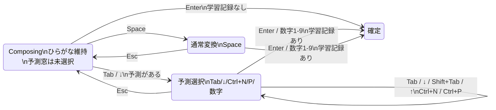

<div align="center">
  
  <h1>Karukan</h1>
  <p>Linux・macOS向け日本語入力システム — ニューラルかな漢字変換エンジン</p>

  [](https://github.com/togatoga/karukan/actions/workflows/karukan-engine-ci.yml)
  [](https://github.com/togatoga/karukan/actions/workflows/karukan-im-ci.yml)
  [](https://github.com/togatoga/karukan/actions/workflows/karukan-fcitx5-ci.yml)
  [](https://github.com/togatoga/karukan/actions/workflows/karukan-macos-ci.yml)
  [](LICENSE-MIT)
</div>

<div align="center">
  
</div>

> これは kazuph による Karukan フォークで、Google IME 風UXに改変済みです。入力中は勝手に変換せず、Tabで予測、Spaceで通常変換を開始する操作感をデフォルトにしています。

## kazuph フォークの Google IME 風UX

このフォークは「ユーザーが操作するまで、ひらがなの Composing を維持する」ことを優先します。ライブ変換はデフォルトOFFで、必要な場合は `config.toml` の `conversion.live_conversion = true` または `Ctrl+Shift+L` でONに戻せます。

| 操作 | このフォークの動作 | 本家 Karukan との差分 |
|------|------------------|----------------------|
| 文字入力中 | ひらがなのまま。候補窓は学習履歴・ユーザー辞書の予測だけを未選択で表示 | 入力ごとのモデル推論候補を混ぜず、1行目の偽ハイライトも出さない |
| Tab / ↓ | 表示中の予測候補をそのまま選択。予測0件なら何もしない | 旧Tabの学習スキップ変換は `conversion.tab_skips_learning = true` で復活 |
| Shift+Tab / ↑ | 表示中の予測候補を逆方向に選択 | 予測リストを再計算しない |
| Ctrl+N / Ctrl+P | 予測選択中に次/前の候補へ移動 | Emacs風移動を予測候補にも対応 |
| 数字1-9 | 表示中の予測候補を即確定 | Tabを押さずに候補番号で確定 |
| Enter | 未選択ならひらがなをそのまま確定。選択中なら候補を確定 | ひらがな確定は学習キャッシュに記録しない |
| Space | 読みと同じ長さの通常変換を開始 | 学習キャッシュの前方一致予測を混ぜない |
| Esc | 予測選択中はひらがな Composing に戻る | 選択状態と表示が一致 |



## ユーザー辞書で語彙力ブースト（Google IMEからの移行）

Google IME（Google 日本語入力）で育てたユーザー辞書は、そのまま karukan に持ち込めます。

**置き場所**（ファイルを置いて `killall KarukanIME` するだけ。複数ファイル可・ファイル名順にマージ）:

| OS | user_dicts ディレクトリ |
|----|--------------------------|
| macOS | `~/Library/Application Support/com.karukan.karukan-im/user_dicts/` |
| Linux | `~/.local/share/karukan-im/user_dicts/` |

**形式**: Mozc/Google IME の辞書TSV（`読み<TAB>表記<TAB>品詞<TAB>コメント`）。karukan は先頭2列（読み・表記）だけを使うので、品詞以降は空でも構いません。

### 手順A: 辞書ツールからエクスポート（推奨）

1. Google IME のメニュー →「辞書ツール」→「管理」→「選択した辞書をエクスポート」でTSVを書き出す
2. 書き出したTSVを上記 `user_dicts/` に置く
3. `killall KarukanIME`（次の入力から新しい辞書が有効）

### 手順B: user_dictionary.db から直接変換（GUI不要）

```bash
python3 scripts/mozc_user_dictionary_db_to_tsv.py \
  "$HOME/Library/Application Support/Google/JapaneseInput/user_dictionary.db" \
  "$HOME/Library/Application Support/com.karukan.karukan-im/user_dicts/google_ime_import.tsv"
killall KarukanIME
```

### 手順C: gtype フィードバック辞書を自動同期

gtype の誤変換履歴を API から取り込み、読み中断なくユーザー辞書を更新します。
APIに接続できない場合は `~/Library/Application Support/GtypeMac/karukan_feedback.tsv` をフォールバックします。
1件ごとの不正行はスキップされ、`reading<TAB>correct<TAB>名詞<TAB>gtype feedback` 形式で出力します。

```bash
python3 scripts/gtype_feedback_sync.py \
  "$HOME/Library/Application Support/com.karukan.karukan-im/user_dicts/gtype_feedback.tsv"
```

launchd で 15分ごとの実行 + `karukan_feedback.tsv` 監視を有効化:
```bash
mkdir -p "$HOME/Library/LaunchAgents"
cp scripts/com.kazuph.karukan.gtype-sync.plist \
  "$HOME/Library/LaunchAgents/com.kazuph.karukan.gtype-sync.plist"
launchctl load -w "$HOME/Library/LaunchAgents/com.kazuph.karukan.gtype-sync.plist"
```

更新確認は `python3 scripts/gtype_feedback_sync.py ...` を直接実行して
`user_dicts` の `gtype_feedback.tsv` を確認、または
`tail -f "$HOME/Library/LaunchAgents/com.kazuph.karukan.gtype-sync.log"`（未設定時は標準出力）で監視します。

### 注意

- 読みが `:` で始まるエントリ（絵文字パック等）は、karukan では `:` が Emoji モードのトリガーのため読みとして到達不能です。手順Bのスクリプトは自動で除外します（karukan は絵文字入力を標準搭載しているため不要）
- 効き方: **Space の通常変換**と予測は、以下を反映します（順序どおり）  
  1) 学習 exact/prefix（同一候補除外）  
  2) ユーザー辞書 exact  
  3) ユーザー辞書前方一致（2文字以上のみ、5件上限、同一候補除外、**読みは全文保持**）  
- システム辞書の前方一致予測はノイズ上がりやすいため、この版では意図的に未実装

## プロジェクト構成

| クレート | 説明 |
|---------|------|
| [karukan-fcitx5](karukan-fcitx5/) | Linux向けIMEフロントエンド — fcitx5アドオン + C FFI |
| [karukan-macos](karukan-macos/) | macOS向けIMEフロントエンド — Swift/InputMethodKit |
| [karukan-im](karukan-im/) | 共有IMEエンジン — ステートマシン、ローマ字変換、karukan-imserver(macOS向けJSON-RPCサーバー) |
| [karukan-engine](karukan-engine/) | コアライブラリ — ローマ字→ひらがな変換 + llama.cppによるニューラルかな漢字変換 |
| [karukan-cli](karukan-cli/) | CLIツール・サーバー — 辞書ビルド、Sudachi辞書生成、辞書ビューア、AJIMEE-Bench、HTTPサーバー |

## 特徴

- **ニューラルかな漢字変換**: GPT-2ベースのモデルをllama.cppで推論し、高度な日本語変換
- **ライブ変換**: 入力と同時に変換結果をリアルタイム表示。Spaceを押さずに変換が進む（`Ctrl+Shift+L` でON/OFF）
- **コンテキスト対応**: 周辺テキストを考慮した日本語変換
- **変換学習**: ユーザーが選択した変換結果を記憶し、次回以降の変換で優先表示。予測変換（前方一致）にも対応し、入力途中でも学習済みの候補を提示
- **システム辞書**: [SudachiDict](https://github.com/WorksApplications/SudachiDict)の辞書データからシステム辞書を構築
- **候補リライター (Mozcから移植)**: 半角カタカナ、英字の大文字小文字・全角半角、記号の関連候補、数字の各種表記（漢数字・大字・ローマ数字・丸数字・16/8/2進数）を自動生成。各候補にはMozc由来の注釈（「半角カタカナ」「16進数」など）が付く
- **絵文字入力**: かな読み（`ぴえん` → 🥺、`きんにく` → 💪）と Slack 風 `:trigger` クエリ（`:smile` → 😄、`:halo` → 😇）の両方をサポート

> **Note:** 初回起動時にHugging Faceからモデルをダウンロードするため、初回の変換開始までに時間がかかります。2回目以降はダウンロード済みのモデルが使用されます。

## インストール

- **Linux (fcitx5)**: [karukan-fcitx5 の README](karukan-fcitx5/README.md#install) を参照
- **macOS**: [karukan-macos の README](karukan-macos/README.md) を参照

## ライセンス

MIT OR Apache-2.0 のデュアルライセンスで提供しています。

- [MIT License](LICENSE-MIT)
- [Apache License 2.0](LICENSE-APACHE)

[karukan-engine/data/](karukan-engine/data/) 配下には [Mozc](https://github.com/google/mozc)（Google製日本語入力システム）から派生したデータを含み、こちらは [BSD 3-Clause License](http://opensource.org/licenses/BSD-3-Clause) のもとで配布されています。各派生ファイルの由来およびMozcの著作権表記は [THIRD_PARTY_LICENSES](THIRD_PARTY_LICENSES) を参照してください。
